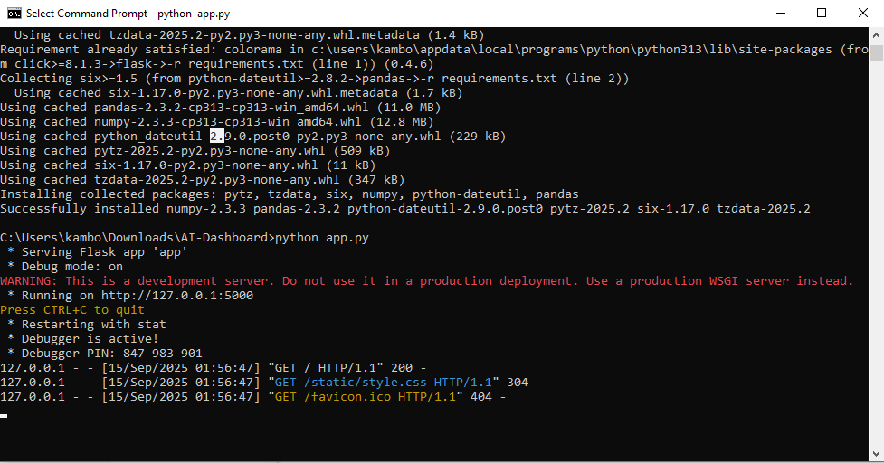
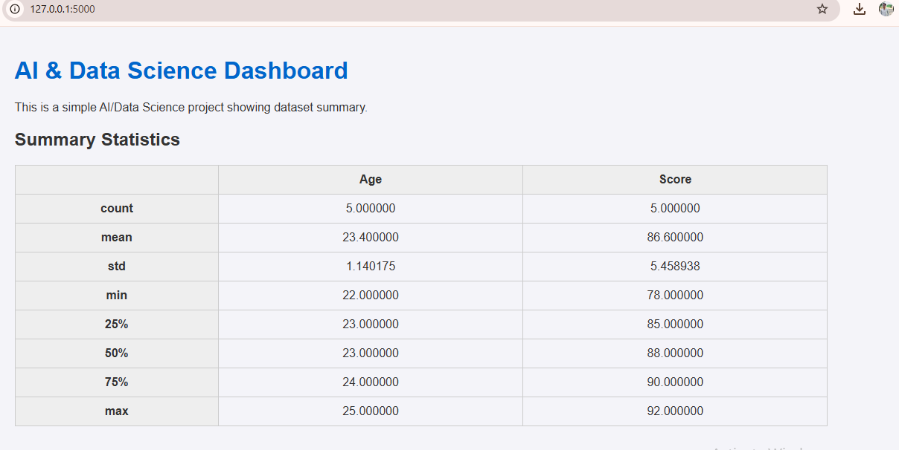

# 🧠 AI & Data Science Dashboard

This is a simple **Flask-based AI/Data Science Dashboard** project that summarizes a dataset and shows useful statistics in the browser.

---

## 🚀 Features
- Built with **Python + Flask**
- Displays **summary statistics** of sample dataset
- Easy to run locally
- Beginner-friendly AI/Data Science mini-project

---
## 📷 Screenshots

### 1. Flask Running in Terminal


### 2. Browser Output



## ⚡ Installation & Run

1. Clone the repo:
   ```bash
   git clone https://github.com/TalalLiaquat/AI-Dashboard.git
   cd AI-Dashboard
   ```

2. Create virtual environment:
   ```bash
   python -m venv venv
   venv\Scripts\activate    # For Windows
   ```

3. Install dependencies:
   ```bash
   pip install -r requirements.txt
   ```

4. Run the project:
   ```bash
   python app.py
   ```

5. Open in browser:
   ```
   http://127.0.0.1:5000/
   ```

---

## 📂 Project Structure
```
AI-Dashboard/
│── app.py
│── requirements.txt
│── README.md
│── templates/
│    └── index.html
│── static/
│    └── style.css
│── screenshots/
```

---

## 🙌 Author
**Talal Liaquat**  
📌 Student of Computer Science | Exploring AI, Data Science & Development  
